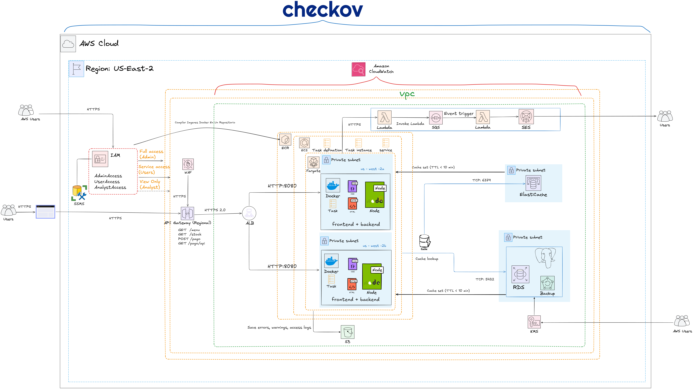

# Pedidos Online para Cadena de Restaurantes

## Contexto del negocio

Durante días de alta demanda, el sistema presenta problemas de saturación que afectan el rendimiento y la disponibilidad del servicio. Existe una falta de sincronización del stock en tiempo real entre la tienda y la plataforma web, lo que impacta tanto a los clientes como a los servicios de delivery. El sistema opera considerando horarios de atención definidos por cada sede (3 sedes en Trujillo) y por el servicio de delivery externo, siendo el horario principal de atención de 11:00 a 23:00 horas. Además, se presentan fallas en servicios, como la geolocalización, lo que impide identificar correctamente la ubicación del cliente. Esto afecta la asignación de repartidores y genera rechazos o retrasos en los pedidos.

El sistema cuenta con una concurrencia diaria de 120 usuarios en promedio, en las horas pico (13:00 y 20:00) el número aumenta a 160 usuarios en promedio. El servicio opera 12 horas diarias de 11:00 a 23:00 de martes a domingo. Cada sesión genera entre 15 y 40 KB de datos entre consultas de menú, registro de pedidos y validaciones, con un volumen diario estimado de 80 a 150 MB. Las respuestas son síncronas para menú, stock y pedidos, asíncronas para notificaciones de error vía SQS/Lambda, y dependientes de terceros para geolocalización 

#### ¿Cuántos usuarios utilizarán el sistema?
360 usuarios diarios (120 por cada una de las 3 sedes).

#### ¿Cuántos usuarios estarán conectados a la vez?
Hasta 480 usuarios concurrentes en horas pico.

#### ¿Cuáles son los periodos de mayor actividad/carga?
13:00 y 20:00 horas (almuerzo y cena).

#### ¿Cuánto tiempo debe estar disponible el servicio?
12 horas diarias, de 11:00 a 23:00, de martes a domingo.

#### ¿Backups y frecuencia?
Backups diarios automáticos con retención de 7 a 14 días.

#### ¿Cuánta data se genera por año?
Aproximadamente 55 GB anuales.

#### ¿Tiempo de respuesta esperado?
Menor a 500 ms en operaciones normales; hasta 1–2 s con servicios externos